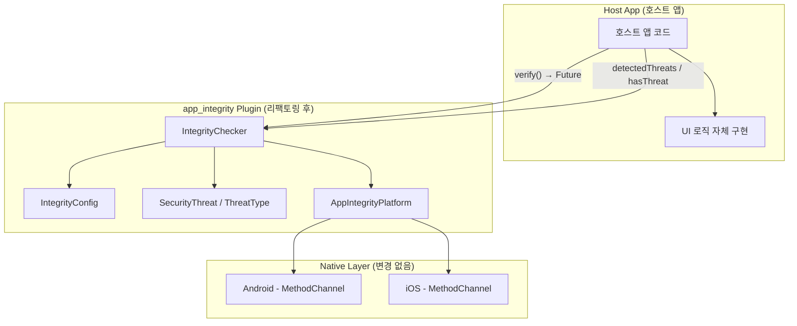

# 설계 문서: Boolean Integrity Response

## 개요

기존 `app_integrity` Flutter Plugin 패키지에서 UI 관련 로직(SecurityAlertDialog, 콜백, CustomDialogBuilder)을 완전히 제거하고, `verify()` 메서드의 반환 타입을 `Future<List<SecurityThreat>>`에서 `Future<bool>`로 변환하는 리팩토링을 수행한다.

이 변경을 통해 패키지는 순수 무결성 검증 라이브러리로서의 역할에 집중하며, UI 표현 책임은 호스트 앱에 위임한다. 상세 위협 정보는 `detectedThreats`와 `hasThreat` getter를 통해 여전히 접근 가능하다.

### 설계 원칙

- **관심사 분리**: 검증 로직과 UI 로직의 완전한 분리
- **단순한 API**: boolean 기반 결과로 사용 편의성 극대화
- **하위 호환성 유지**: 네이티브 코드(android/, ios/)는 변경 없음
- **점진적 정보 접근**: 단순 boolean → 상세 위협 목록의 계층적 접근 지원

## 아키텍처



### 변경 전후 비교

| 항목 | 변경 전 | 변경 후 |
|------|---------|---------|
| `verify()` 반환 타입 | `Future<List<SecurityThreat>>` | `Future<bool>` |
| UI 컴포넌트 | SecurityAlertDialog 포함 | 완전 제거 |
| 콜백 | onThreatDetected, customDialogBuilder | 없음 |
| 상세 정보 접근 | verify() 반환값 | detectedThreats getter |
| UI import | material.dart, widgets.dart | foundation.dart만 사용 |

## 컴포넌트 및 인터페이스

### 1. IntegrityChecker (수정)

핵심 검증 클래스. verify()의 반환 타입을 변경하고 콜백 호출 로직을 제거한다.

```dart
class IntegrityChecker {
  final IntegrityConfig config;
  final List<SecurityThreat> _detectedThreats = [];

  IntegrityChecker({required this.config});

  /// 위협이 탐지되었는지 여부.
  bool get hasThreat => _detectedThreats.isNotEmpty;

  /// 탐지된 위협의 불변 목록.
  List<SecurityThreat> get detectedThreats =>
      List.unmodifiable(_detectedThreats);

  /// 무결성 검증을 수행하고 위협 탐지 여부를 boolean으로 반환한다.
  /// true: 위협 탐지됨, false: 위협 없음
  Future<bool> verify() async {
    // 디버그 모드 체크
    if (kDebugMode && config.skipInDebugMode) {
      debugPrint('디버그 모드: 무결성 검증 건너뜀');
      return false;
    }

    _detectedThreats.clear();

    // Android 서명 검증, iOS 코드서명 검증, 설치 출처 검증
    // (기존 로직 동일하게 수행, 콜백 호출 부분만 제거)

    return _detectedThreats.isNotEmpty;
  }
}
```

**주요 변경 사항:**
- `verify()` 반환 타입: `Future<List<SecurityThreat>>` → `Future<bool>`
- 콜백 호출 로직(`config.onThreatDetected`) 제거
- `_detectedThreats.clear()`를 검증 시작 시점으로 이동 (디버그 모드 건너뛰기 후에는 이전 상태 유지하지 않고 빈 상태 유지)
- 반환값을 `_detectedThreats.isNotEmpty`로 변경

### 2. IntegrityConfig (수정)

순수 검증 파라미터만 포함하도록 축소한다.

```dart
class IntegrityConfig {
  final List<String> validSigningHashes;
  final List<String> validBundleIds;
  final bool enableInstallSourceCheck;
  final bool skipInDebugMode;

  const IntegrityConfig({
    this.validSigningHashes = const [],
    this.validBundleIds = const [],
    this.enableInstallSourceCheck = false,
    this.skipInDebugMode = true,
  });
}
```

**제거 대상:**
- `ThreatCallback` typedef
- `CustomDialogBuilder` typedef
- `onThreatDetected` 필드
- `customDialogBuilder` 필드
- `package:flutter/widgets.dart` import

### 3. SecurityAlertDialog (삭제)

`lib/src/ui/security_alert_dialog.dart` 파일 전체를 삭제한다. `lib/src/ui/` 디렉토리도 제거한다.

### 4. Barrel 파일 (수정)

`lib/app_integrity.dart`에서 UI 관련 export를 제거한다.

```dart
library app_integrity;

export 'src/models/threat_type.dart';
export 'src/models/security_threat.dart';
export 'src/models/integrity_config.dart';
export 'src/integrity_checker.dart';
export 'app_integrity_platform_interface.dart';
```

**제거:** `export 'src/ui/security_alert_dialog.dart';`

### 5. Example App (수정)

boolean 기반 API를 사용하도록 업데이트한다.

```dart
Future<void> _runVerification() async {
  setState(() => _isLoading = true);
  try {
    final hasThreat = await _checker.verify();
    if (mounted) {
      setState(() {
        _threats = _checker.detectedThreats;
        _isLoading = false;
        _hasVerified = true;
      });
    }
  } catch (e) {
    // 에러 처리
  }
}
```

## 데이터 모델

### SecurityThreat (변경 없음)

```dart
class SecurityThreat {
  final ThreatType type;
  final String message;

  const SecurityThreat({required this.type, required this.message});
}
```

### ThreatType (변경 없음)

```dart
enum ThreatType {
  signatureMismatch,
  signatureUnavailable,
  bundleIdMismatch,
  codeSignatureDirectoryMissing,
  executableCorrupted,
  unofficialInstallSource,
}
```

### IntegrityConfig (수정 후)

| 필드 | 타입 | 기본값 | 설명 |
|------|------|--------|------|
| validSigningHashes | List\<String\> | const [] | Android APK 서명 SHA-256 해시 목록 |
| validBundleIds | List\<String\> | const [] | iOS 유효 번들 ID 목록 |
| enableInstallSourceCheck | bool | false | 설치 출처 검증 활성화 여부 |
| skipInDebugMode | bool | true | 디버그 모드에서 검증 건너뛰기 |

## 정확성 속성 (Correctness Properties)

*정확성 속성(Property)이란 시스템의 모든 유효한 실행에서 항상 참이어야 하는 특성 또는 동작을 의미한다. 이는 인간이 읽을 수 있는 명세와 기계가 검증 가능한 정확성 보증 사이의 다리 역할을 한다.*

### Property 1: verify() 반환값과 상태 일관성

*For any* IntegrityChecker 인스턴스와 *for any* 유효한 IntegrityConfig 설정에서, verify() 호출이 완료된 후 반환값, hasThreat, 그리고 detectedThreats.isNotEmpty의 세 값은 항상 동일해야 한다.

**Validates: Requirements 2.1, 2.2, 4.2, 5.2, 5.5**

### Property 2: detectedThreats 불변성

*For any* IntegrityChecker 인스턴스에서, detectedThreats getter가 반환하는 목록에 대해 add, remove, clear 등의 수정 연산을 시도하면 항상 UnsupportedError가 발생해야 한다.

**Validates: Requirements 4.1**

### Property 3: 연속 호출 시 상태 교체

*For any* IntegrityChecker 인스턴스에서, verify()를 N번(N ≥ 2) 연속 호출한 후 detectedThreats는 항상 마지막 verify() 호출의 결과만을 포함해야 하며, 이전 호출의 위협 정보는 포함하지 않아야 한다.

**Validates: Requirements 4.5, 5.3**

### Property 4: PlatformException 복원력

*For any* 검증 단계 조합에서, 특정 검증 단계에서 PlatformException이 발생하더라도 해당 단계 이후의 나머지 검증 단계는 정상적으로 수행되어야 하며, verify()는 정상적으로 boolean 값을 반환해야 한다.

**Validates: Requirements 2.5, 5.4**

## 에러 처리

### PlatformException 처리 전략

| 발생 위치 | 처리 방식 |
|-----------|-----------|
| Android 서명 검증 | debugPrint로 오류 출력, 해당 단계 건너뛰기, 나머지 계속 |
| iOS 코드서명 검증 | debugPrint로 오류 출력, 해당 단계 건너뛰기, 나머지 계속 |
| 설치 출처 검증 | debugPrint로 오류 출력, 해당 단계 건너뛰기 |

### 모든 검증 단계 예외 시

모든 검증 단계에서 PlatformException이 발생하여 어떤 위협도 명시적으로 탐지되지 않은 경우, `_detectedThreats`는 빈 상태로 유지되며 `verify()`는 `false`를 반환한다. 이는 "검증 불가 = 안전"이 아닌 "위협 미탐지"로 해석한다.

### 디버그 모드 동작

`kDebugMode && config.skipInDebugMode` 조건이 true이면:
1. 모든 검증 로직을 건너뜀
2. `debugPrint('디버그 모드: 무결성 검증 건너뜀')` 출력
3. `_detectedThreats`를 빈 상태로 유지
4. 즉시 `false` 반환

## 테스팅 전략

### 단위 테스트

| 테스트 항목 | 검증 내용 |
|-------------|-----------|
| IntegrityConfig 기본값 | 4개 필드의 기본값이 올바른지 확인 |
| IntegrityConfig 생성자 | 정확히 4개 파라미터만 허용하는지 확인 |
| 디버그 모드 건너뛰기 | skipInDebugMode=true, kDebugMode=true일 때 false 반환 |
| 초기 상태 | verify() 호출 전 hasThreat=false, detectedThreats=[] |
| ThreatType enum 값 | 6개 값이 모두 존재하는지 확인 |
| 검증 순서 | Android→iOS→설치출처 순서로 수행되는지 확인 |

### 속성 기반 테스트 (Property-Based Testing)

**라이브러리**: `dart_check` 또는 `glados` (Dart PBT 라이브러리)

**설정**: 각 속성 테스트는 최소 100회 반복 실행

| Property | 테스트 내용 | 태그 |
|----------|------------|------|
| Property 1 | 다양한 Config + Mock 플랫폼 응답 → 반환값==hasThreat==detectedThreats.isNotEmpty | Feature: boolean-integrity-response, Property 1: verify() 반환값과 상태 일관성 |
| Property 2 | 다양한 위협 목록 → detectedThreats 수정 시도 시 UnsupportedError | Feature: boolean-integrity-response, Property 2: detectedThreats 불변성 |
| Property 3 | 랜덤 순서의 다중 verify() 호출 → 마지막 결과만 유지 | Feature: boolean-integrity-response, Property 3: 연속 호출 시 상태 교체 |
| Property 4 | 랜덤 예외 조합 → 나머지 단계 수행 완료 및 정상 반환 | Feature: boolean-integrity-response, Property 4: PlatformException 복원력 |

### 정적 검증 (Smoke Tests)

| 검증 항목 | 방법 |
|-----------|------|
| UI import 부재 | lib/src/ 내 파일에서 material.dart, widgets.dart, cupertino.dart import 없음 |
| SecurityAlertDialog 제거 | lib/src/ui/ 디렉토리 부재 확인 |
| Barrel 파일 정리 | 4개 심볼만 export 확인 |
| typedef 제거 | ThreatCallback, CustomDialogBuilder 부재 확인 |

### 테스트 환경

- `AppIntegrityPlatform.instance`를 mock 구현으로 교체하여 플랫폼 의존성 없이 테스트
- `Platform.isAndroid`/`Platform.isIOS` 조건 분기는 테스트 헬퍼로 제어
- `kDebugMode`는 테스트 환경에서 항상 true이므로 `skipInDebugMode: false`로 설정하여 실제 검증 로직 테스트
